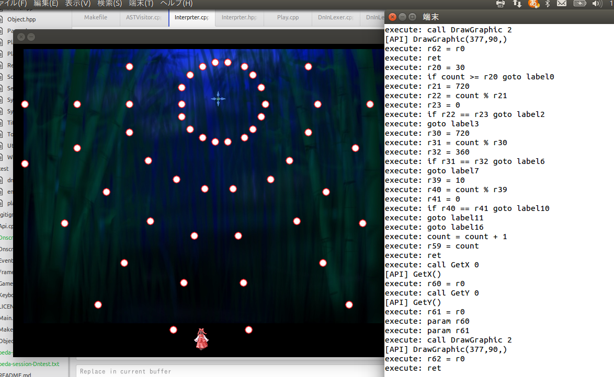

# Dnscript
Dnscript is specific scripting language specializing to build the "danmaku" in shooting game.

It's not stable yet. Any kind of bugs can be caused.

## Usage
You can script action of enemy by changing DSL code in Dnlang/sample/enemy.dn

```javascript:enemy.dn
let count=0;
let cx=GetCenterX();
let imgEnemy = "img/Enemy.png";
let imgAngle=0;
let shotAngle=0;

function @Initialize() {
	LoadGraphic(imgEnemy);
	SetLife(1500);
	SetGraphicRect(1,1,32,32);
	SetTexture(imgEnemy);
	SetMovePosition02(cx+0,60,60);
	return;
}

function @MainLoop() {
	if (count >= 30) {
		if (count % 180 == 0 && count < 4000) {
			SetMovePosition02(cx-50,100,20);
		}
		if(count % 180 == 90 && count < 4000){
			SetMovePosition02(cx+50,100,20);
		}
		if(count % 10 == 0){
			let angle = 0;
			while(angle < 360) {
				CreateShot01(GetX() + GetW() / 2, GetY() + GetH() / 2,10,angle,0,1);
				angle += 20;
			}
		}
	}
	++count;
	return;
}

function @Finalize() {
}

function @DrawLoop() {
	DrawGraphic(GetX(), GetY());
	return;
}
```

## Preview

